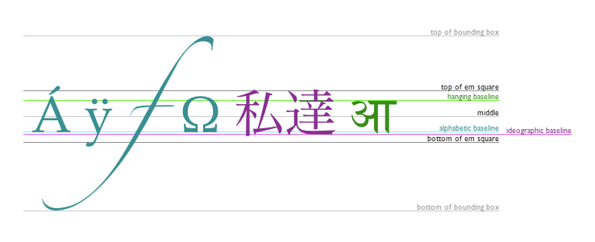

# Chart.js 
Charts is away to display data visually and is much better than tables ,They are easier to look at and convey data quickly, but they’re not always easy to create

- Chart.js  javaScript plugin.
- uses canvas element .
- bar charts , line charts , pie charts , etc.

Drawing a line chart

To draw a line chart, the first thing we need to do is create a canvas element in our HTML in which Chart.js can draw our chart. 

Example canvas id="buyers" width="600" height="400"

- To drawing a pie chart 
canvas id="countries" width="600" height="400"

- To drawing a bar chart

canvas id="income" width="600" height="400"

### Drawing text 

The canvas rendering context provides two methods to render text

- fillText(text, x, y [, maxWidth]) Fills a given text at the given (x,y) position. Optionally with a maximum width to draw.
- strokeText(text, x, y [, maxWidth]) Strokes a given text at the given (x,y) position. Optionally with a maximum width to draw.

### Color

fillStyle color Sets the style used when filling shapes. strokeStyle color Sets the style for shapes' outlines.

## Canvas API

What are The canvas element.

{canvas} looks like the {img }element, with the only clear difference being that it doesn't have the src and alt attributes. Indeed, the {canvas} element has only two attributes, width and height. These are both optional and can also be set using DOM properties.
example , 
canvas id="tutorial" width="150" height="150"

#### Fallback content

Providing fallback content is very straightforward: just insert the alternate content inside the canvas element. Browsers that don't support canvas will ignore the container and render the fallback content inside it. Browsers that do support canvas will ignore the content inside the container, and just render the canvas normally.
example 
canvas id="stockGraph" width="150" height="150"
  current stock price: $3.15 + 0.15

#### Required /canvastag
As a consequence of the way fallback is provided, unlike the img element, the canvas element requires the closing tag (/canvas). 

#### Checking for support
The fallback content is displayed in browsers which do not support canvas. Scripts can also check for support programmatically by testing for the presence of the getContext() method. 

